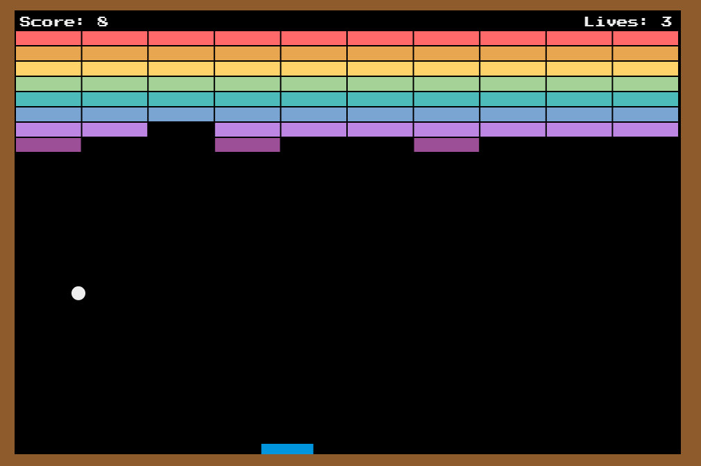

# **Juego Breakout**

Este es un juego de Breakout creado solo con HTML, CSS y Javascript.

## Cómo jugar

1. Abre el archivo index.html en tu navegador web.
2. Usa las flechas izquierda y derecha del teclado o el cursor del mouse para mover la paleta y evitar que la pelota se caiga.
3. Destruye todos los ladrillos para ganar.

## Archivos

- `index.html`: archivo principal que contiene la estructura HTML del juego.
- `style.css`: archivo de estilo que contiene la apariencia visual del juego.
- `script.js`: archivo que contiene la lógica del juego escrita en Javascript.

## Créditos

Este juego fue creado por [**@Drummes12**](https://github.com/drummes12) basado en el tutorial de [MDN](https://developer.mozilla.org/es/docs/Games/Tutorials/2D_Breakout_game_pure_JavaScript).
